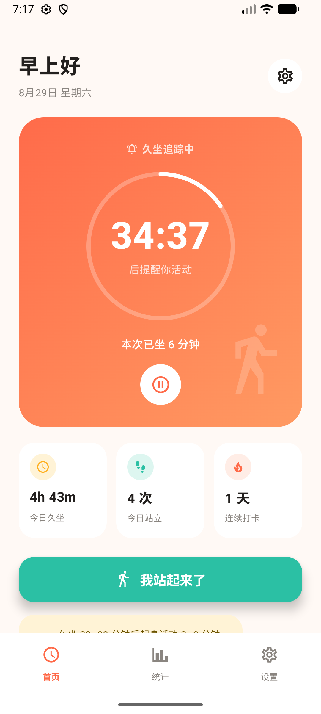
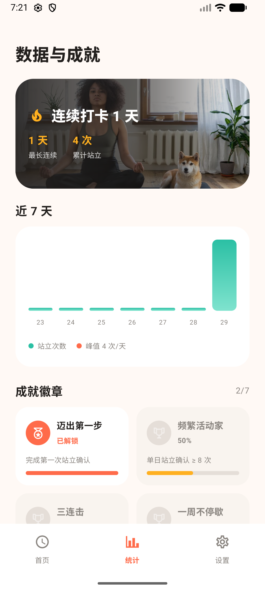
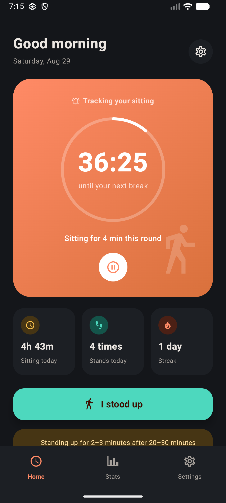
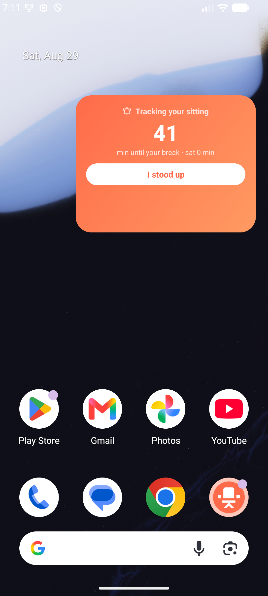

# SitBreak 久坐提醒

> 坐久了，起来动一动 —— 一个完全离线的 Android 久坐提醒应用。
>
> Smart sedentary reminder for Android. Works fully offline, tailors your break interval to age & BMI.

<p>
  
  
  
  
</p>

## 功能特性

- **智能间隔推荐** —— 根据年龄与 BMI（中国成人标准：超重 24 / 肥胖 28）推荐提醒间隔，基础 45 分钟，久坐风险越高提醒越频繁，范围 30~90 分钟，可手动调整（15~120）。
- **三档提醒方式** —— 轻提醒（微信式短震）/ 标准提醒（铃声+震动）/ 强提醒（持续响铃震动 30 秒，确认站立才停）。
- **勿扰时段** —— 睡眠时段静默，提醒自动顺延到窗口结束；支持跨午夜（如 22:00 → 07:00）。
- **智能暂停** —— 开启后由计步传感器判定：连续走动 40 步即视为已离座，自动完成站立打卡，无需掏出手机。
- **数据与成就** —— 连续打卡、近 7 天双系列柱状图（站立次数 + 久坐时长）、7 项成就徽章；跨午夜的久坐会话按自然日切分入账。
- **桌面小组件** —— 不打开应用也能看倒计时、一键打卡。
- **中英双语** —— 应用内切换，Android 13+ 与系统「应用语言」设置互通；通知与小组件文案同步切换。
- **深色模式** —— 全套品牌色双主题适配。

## 隐私

应用**未申请 INTERNET 权限**，无法联网。所有统计数据（Room）与设置（DataStore）仅保存在本机，无账号、无上传、无第三方 SDK。

## 权限说明

| 权限 | 用途 |
| --- | --- |
| `POST_NOTIFICATIONS` | 发送提醒与常驻计时通知 |
| `SCHEDULE_EXACT_ALARM` | 精确到点的提醒闹钟（可选，未授权时会略有延迟） |
| `ACTIVITY_RECOGNITION` | 智能暂停读取计步器（可选，仅在该功能开启时使用） |
| `RECEIVE_BOOT_COMPLETED` | 重启后恢复追踪服务 |
| `FOREGROUND_SERVICE` / `WAKE_LOCK` / `VIBRATE` | 常驻计时服务与震动反馈 |

## 构建

环境要求：JDK 17，Android SDK 36（Android Studio 最新版即可）。

```bash
# 调试包：app/build/outputs/apk/debug/app-debug.apk
./gradlew assembleDebug

# 单元测试（domain 层 45 个用例）
./gradlew testDebugUnitTest
```

> 国内网络若下载 `dl.google.com` 依赖超时，可为 Gradle 配置代理或改用镜像仓库。

## 推荐算法

间隔 = 基础 45 分钟 + 年龄修正（青年 +10 / 中青年 0 / 中年 −5 / 中老年 −10）+ BMI 修正（偏瘦 +5 / 正常 0 / 超重 −5 / 肥胖 −10），结果夹在 [30, 90] 分钟。依据主流研究：久坐 20~30 分钟后起身活动 2~3 分钟对代谢与心血管最有益。

## 技术栈

Kotlin 2.0 · Jetpack Compose（Material 3，BOM 2024.12）· Room 2.6（schema 导入版本库，真实迁移）· DataStore Preferences · AlarmManager 精确闹钟 + 前台服务 · 计步传感器。无 DI 框架，单 Activity 多 Tab。

## 项目结构

```
app/src/main/java/com/sitbreak/
├── data/          UserPrefs(DataStore)、StatsDatabase(Room)与统计仓库
├── domain/        纯 Kotlin 业务逻辑：推荐引擎/勿扰时段/会话切分/成就引擎（含单测）
├── service/       前台服务、闹钟调度、通知、开机自启、智能暂停计步
├── ui/            Compose 界面：引导/首页/统计/设置 + 通用组件与主题
├── util/          时长文案、应用内语言切换
└── widget/        桌面小组件（RemoteViews）
```

minSdk 26（Android 8.0）· targetSdk 36 · versionName 1.0.0
